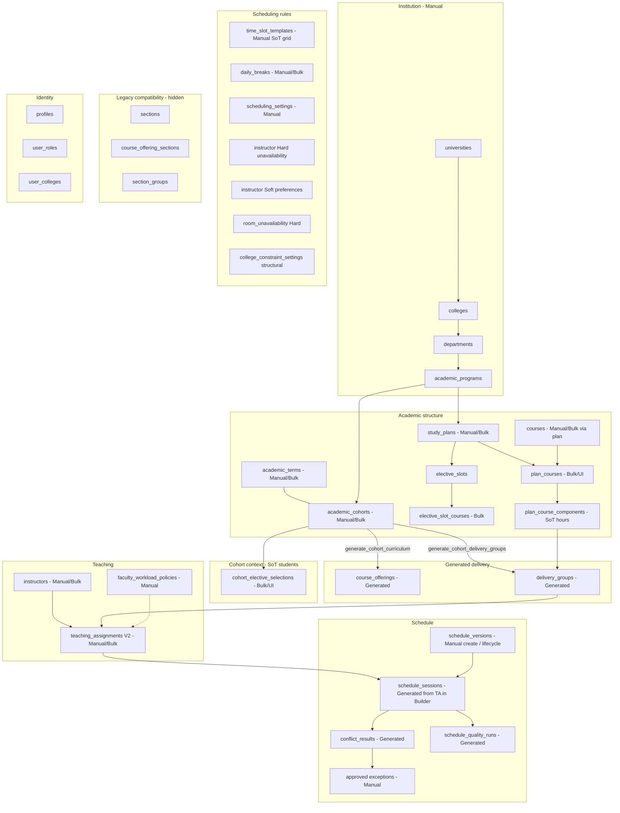

# Target Domain Model

**Phase:** SYSTEM-WIDE-DOMAIN-AND-ADMIN-ARCHITECTURE-AUDIT-01
**Baseline:** `c6b0d861f006d4202349bfa77ed24a5508e2b727`
**Delta completion:** `SYSTEM-AUDIT-DELTA-COMPLETION-01`

## Official target terminology

| Domain contract | Required UI label |
| --- | --- |
| `academic_cohort` | الدفعة الدراسية |
| `cohort_elective_selections` | المقررات الاختيارية المعتمدة |
| `scheduling_settings` / working days / time slots | أيام وفترات الدوام |
| `delivery_groups` | مجموعات المحاضرات والمعامل |
| `teaching_assignments` | الإسناد التدريسي |

These five labels are mandatory in the target UI. Technical names remain documentation identifiers only.

## Target shared-delivery concept

Catalog sharing means that one course is associated with several programs or departments. It does not combine
academic delivery. The distinct target capability is **«المجموعات المشتركة للمحاضرات»**: an optional shared group
for one course component when several independently defined cohort courses are delivered together.

- Every participating cohort course remains independent in its study plan and generated curriculum.
- Cohorts are never academically merged.
- One optional shared lecture group links several participating cohort-course components.
- It has one or more teaching assignments and produces one session visible to every participating cohort.
- That session appears once in the instructor timetable and once in the room timetable.
- Capacity, conflicts, assigned hours, college, study system, and authorization must be validated.
- `regular` and `parallel` are not combined by default.
- A theory component may be shared while labs remain separate.
- No implementation exists. The capability remains fail-closed until a separately approved model is delivered.
- This audit intentionally does not choose a final table name or migration design.

## Classification legend

| Tag | Meaning |
| --- | --- |
| Manual | Entered in UI |
| Bulk | Excel import (atomic commit) |
| Generated | System RPC / engine |
| Derived | Read-only / report |
| Legacy | Compatibility only — not Pilot SoT |

## Mermaid — target academic + scheduling model

## One source of truth per concept

| Concept | Single SoT |
| --- | --- |
| Tenant | `colleges` |
| Program ownership | `academic_programs.department_id` |
| Student academic set | `academic_cohorts` |
| Scheduling headcount | approved `scheduling_cohort_term_headcounts` (with approved scoped overrides) |
| Curriculum membership | approved `study_plans` + `plan_courses` |
| Contact hours / component type | `plan_course_components` |
| Elective decision | `cohort_elective_selections` |
| Offering instance | generated `course_offerings` |
| Teaching split | generated `delivery_groups` |
| Who teaches what hours | V2 `teaching_assignments` |
| When/where taught | `schedule_sessions` |
| Time grid | `time_slot_templates` (+ `daily_breaks`, bounds from `scheduling_settings`) |
| Hard deny instructor/room | unavailability rows (`is_preference=false` / `room_unavailability`) |
| Soft preference | preference-flagged availability only |
| Structural rule weights | `college_constraint_settings` |
| Detected conflicts | `conflict_results` (never master-edited as rules) |
| Workload standard | `faculty_workload_policies` |
| Isolation axes | `college_id` + `study_system` (`regular`\|`parallel`) |

## Scheduling headcount foundation

Scheduling uses only the approved cohort × term `scheduling_headcount`; it never falls back to
`academic_cohorts.expected_students`. Optional approved overrides may scope the final count to a
course offering and/or plan-course component. The source-only migration is **NOT APPLIED** pending
`APPROVE_DB_MIGRATION_APPLY`; A2 shared delivery remains blocked until application and data entry.

## Explicit non-SoT (must not drive Pilot)

- `sections`, `course_offering_sections`, `section_groups*`
- Manual `time_slots` as competing grid
- Legacy teaching_assignments without `delivery_group_id`
- Imported final timetable sessions (`existing_schedule_sessions`)
- Reports inventing domain rules

## Managed vs generated summary

| Manual | Bulk | Generated | Derived | Legacy |
| --- | --- | --- | --- | --- |
| Org tree, lookups, settings, constraints, availability, versions create, exceptions | terms, plans, instructors, rooms, breaks, cohorts, electives, TA V2 | offerings, DGs, sessions, conflicts, quality | reports, readiness views | sections, COS, section_groups, V1 TA/offerings import |
